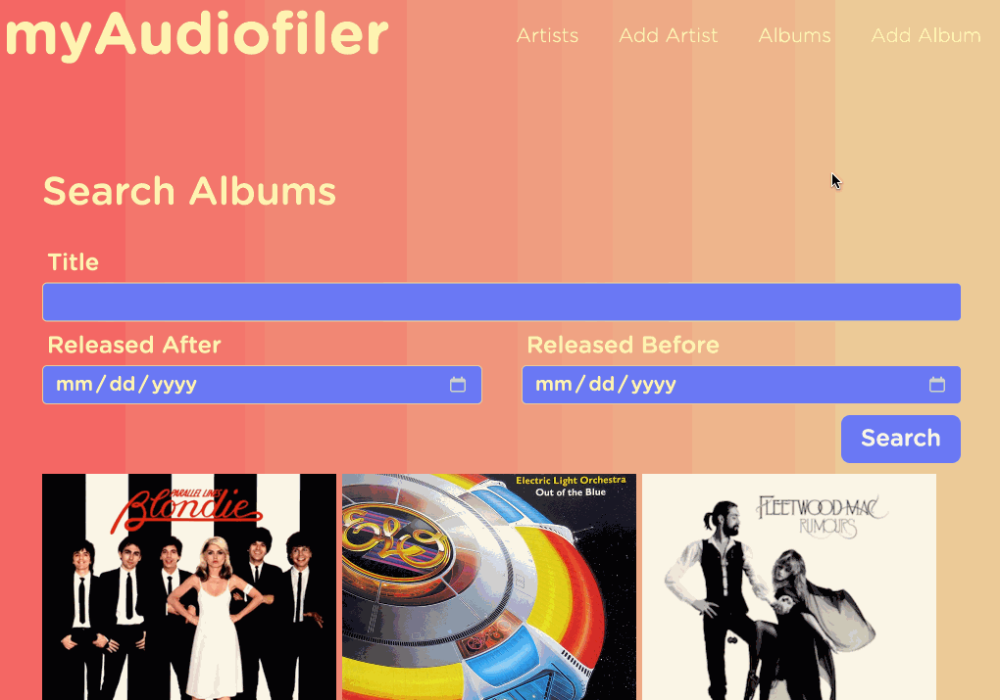
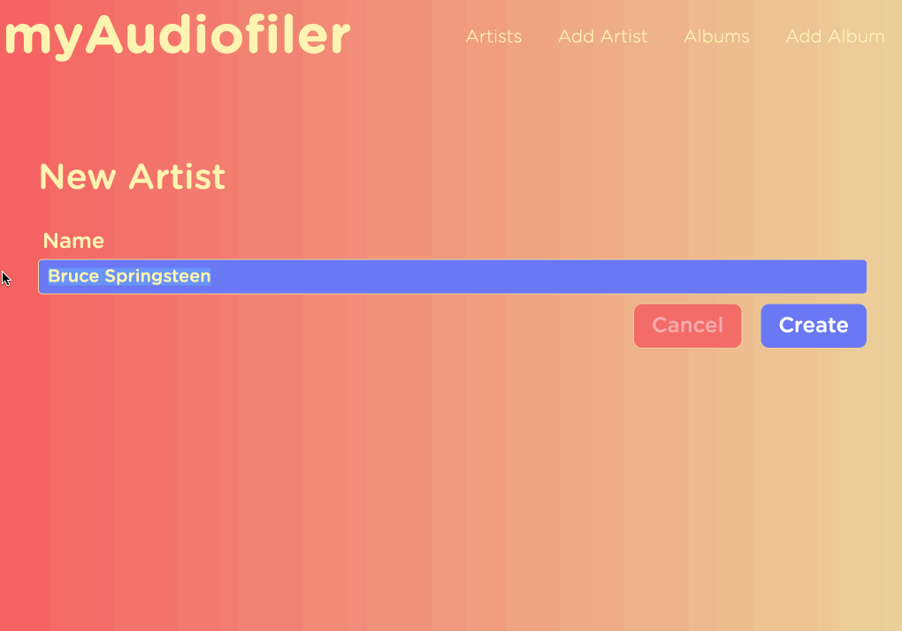
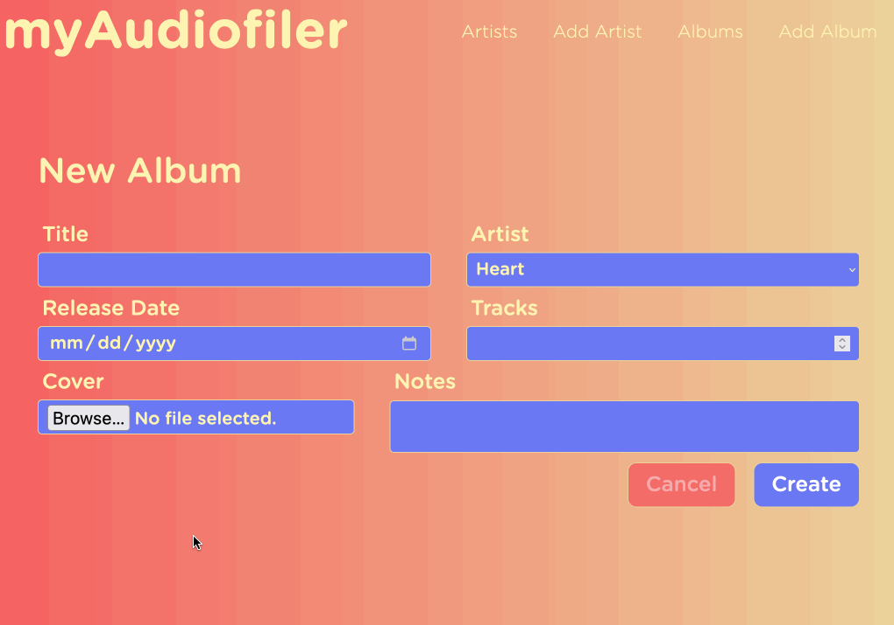
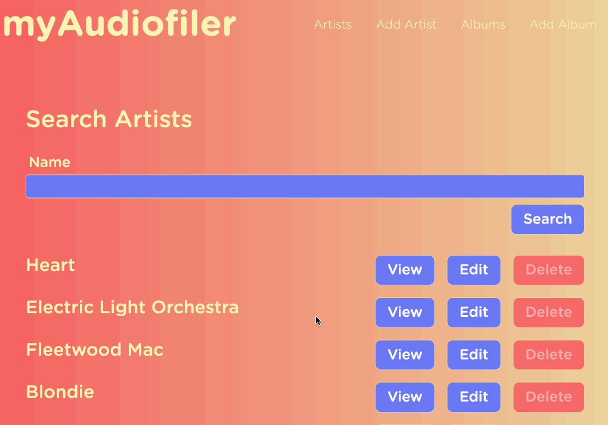
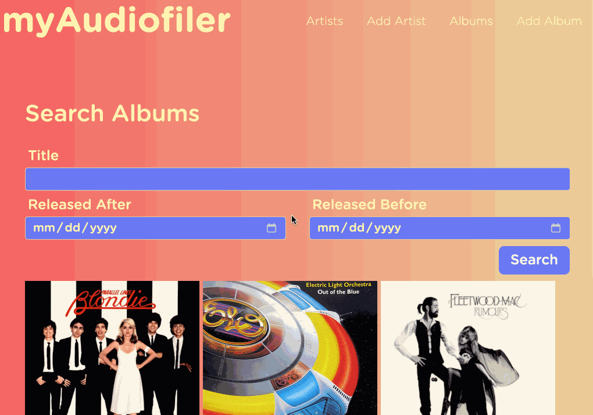
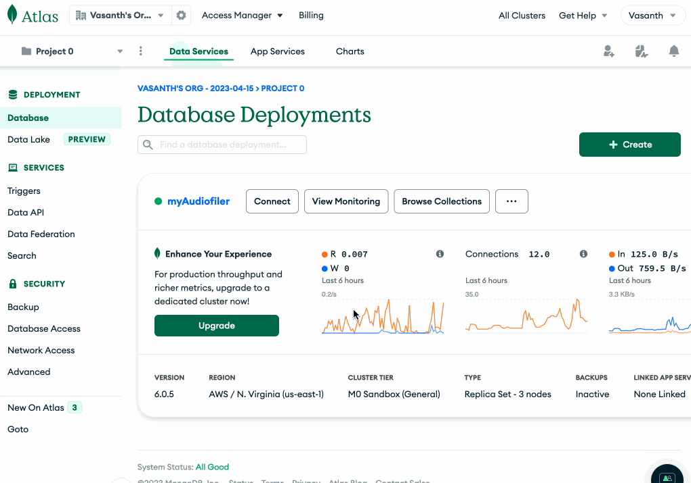
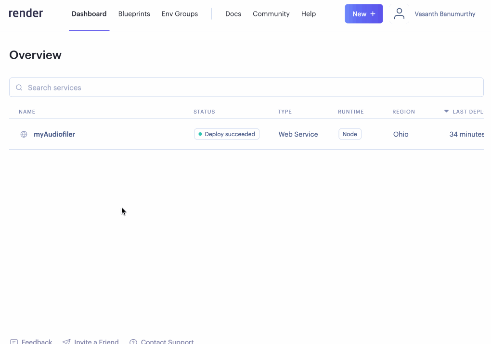

<p align="center">
  
</p>

## Overview


Welcome to myAudiofiler, our group project for [SOFTWARE ENGINEERING 01:198:431](https://www.cs.rutgers.edu/academics/undergraduate/course-synopses/course-details/01-198-431-software-engineering) @ Rutgers University

<p align="center">
  
</p>

This cloub-based web app is a personalized music management solution for record collectors/audiophiles. 

We are deploying our app using Render.

For more information, feel free to view our documentation below. 

* [Requirement Report](./documents/requirements.pdf)
* [Design Document](./documents/design.pdf)
* [Overview Presentation](./documents/presentation.pdf)
* [Demo Presenation](./documents/demo.pdf)

## Functionality

### Add Artists
<p align="center">
  
</p>

### Add Albums

<p align="center">
  
</p>

### Search By Artist
<p align="center">
  
</p>

### Search By Album Fields
<p align="center">
  
</p>

## Implementation

* [HTML](https://developer.mozilla.org/en-US/docs/Web/HTML)

* [CSS](https://developer.mozilla.org/en-US/docs/Web/CSS)

* [JavaScript](https://developer.mozilla.org/en-US/docs/Web/JavaScript)

* [EJS](https://ejs.co/)

* [Node and Express](https://developer.mozilla.org/en-US/docs/Learn/Server-side/Express_Nodejs/Introduction)

* [MongoDB Atlas](https://www.mongodb.com/docs/)
<p align="center">
  
</p>


* [Mongoose](https://mongoosejs.com/)

* [Render](https://render.com/)
<p align="center">
  
</p>


* [npm](https://www.npmjs.com/)


## Running Instructions

Use the command ```npm run devStart``` to run locally

## Testing

We ran out tests using [Jest](https://jestjs.io/). 

We split our test code into two categories: [Albums](./albumTest.js) and [Artists](./artistTest.js)

View our detailed [Test Report](./documents/testreport.pdf) for more info. 


## Collaboration

View our [Collaboration Guide](./documents/collaboration.pdf) to see how we developed the app
